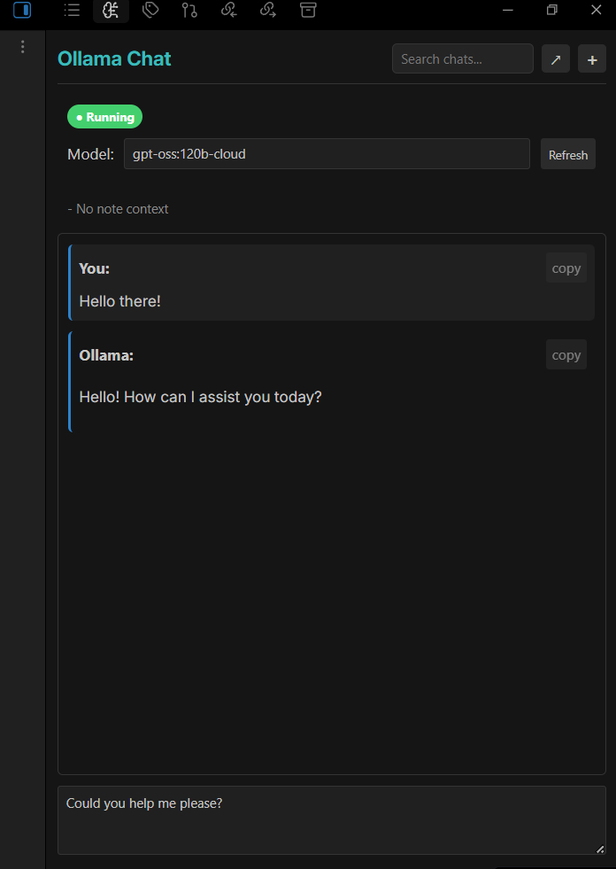
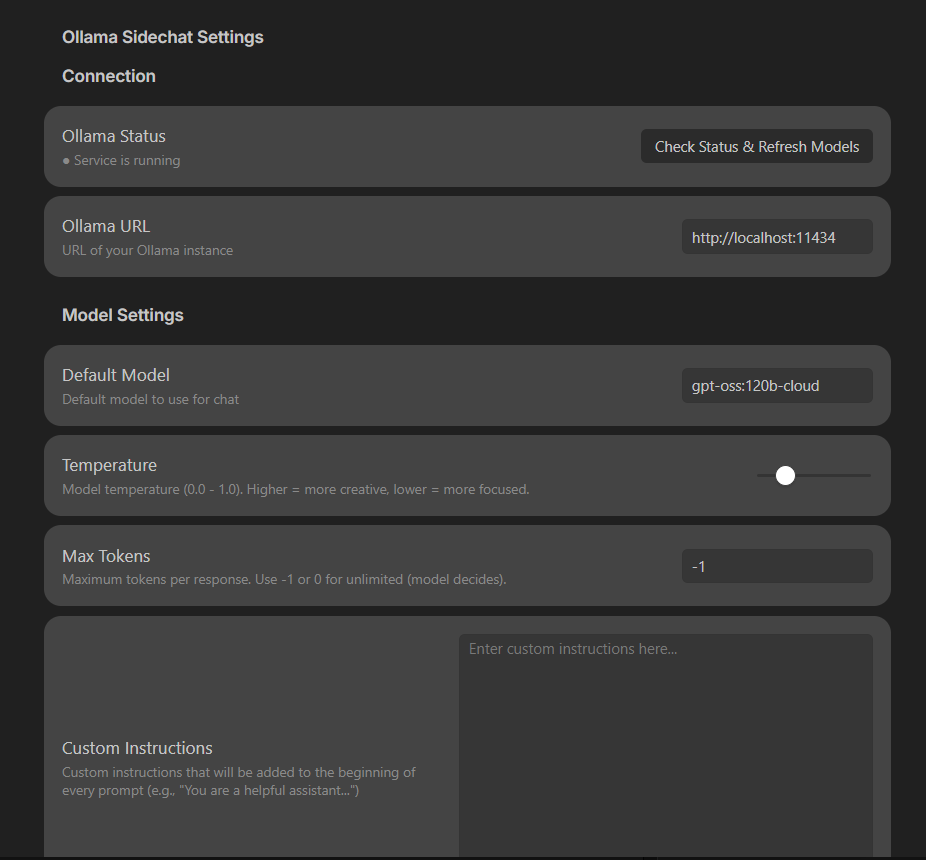
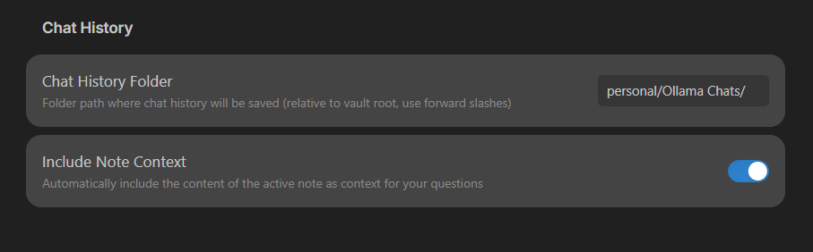

# Ollama Sidechat for Obsidian

A side panel chat interface for [Ollama](https://ollama.ai/) in Obsidian. Chat with local LLMs directly in your vault.

## Features

- 💬 **Side Panel Chat** — Chat with Ollama without leaving your notes
- 📝 **Note Context** — Automatically includes active note content as context
- 💾 **Chat History** — Saves conversations as searchable markdown files
- ⚡ **Streaming Responses** — See responses as they're generated
- 🔄 **Model Switching** — Switch between available models on the fly

## Installation

1. Install [Ollama](https://ollama.ai/) on your system
2. Pull a model: `ollama pull llama3.1`
3. Copy this plugin to `.obsidian/plugins/ollama-sidechat/`
4. Enable the plugin in Obsidian Settings → Community Plugins

## Usage

1. Click the brain icon in the ribbon (or run command "Open Ollama Chat")
2. Start Ollama on your machine (if using it locally)
3. Type your message and press **Enter** to send
4. Use **Shift+Enter** for multi-line input




## Settings

| Setting | Description |
|---------|-------------|
| **Ollama URL** | API endpoint (default: `http://localhost:11434`) |
| **Default Model** | Model to use for chat |
| **Temperature** | Response creativity (0-1) |
| **Max Tokens** | Token limit per response (-1 = unlimited) |
| **Chat History Folder** | Where to save chat files |
| **Include Note Context** | Send active note as context |





## Chat History

Chats are saved as markdown files organized by month:

```
Ollama Chats/
└── 2026-01/
    └── 2026-01-22_14-30-15_my-question.md
```

Each file includes YAML frontmatter with metadata and links to context notes.

## Requirements

- Obsidian 0.15.0+
- [Ollama](https://ollama.ai/) installed locally

## License

MIT
